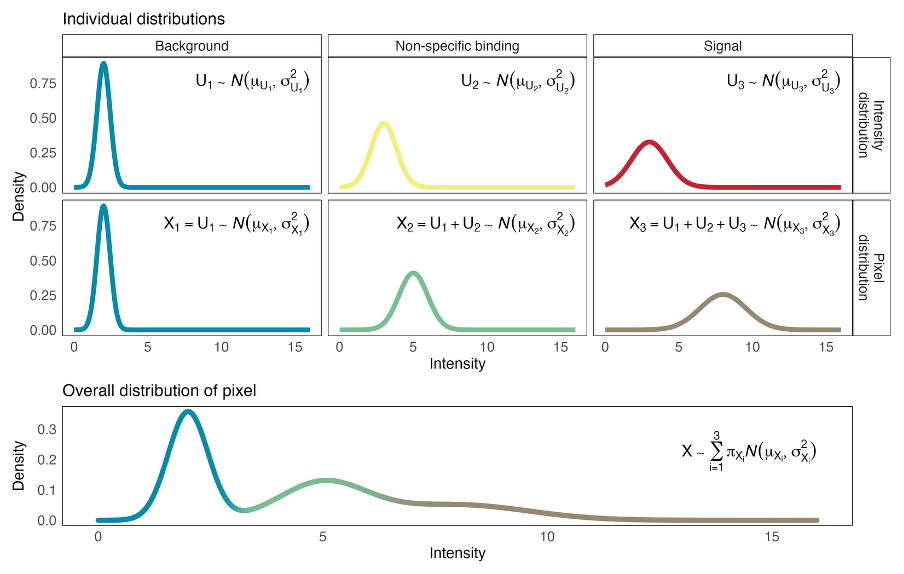

# bgnorm

## Overview

**bgborm** is a Gaussian mixture model (GMM)-based method for background correction and normalization of spatial imaging data, particularly multiplexed spatial proteomics images. The package models intensity distributions using a three-component mixture model and performs marker- and pixel- or cell-level signal adjustment to remove technical background while preserving biological variation.

bgnorm provides tools for processing multi-channel imaging intensities and generating background-adjusted measurements suitable for downstream spatial and single-cell analyses.

### Theoretical Background

bgnorm assumes three types of pixels: - **Background** ($X_1 = U_1$): Only background signals - **Non-specific binding** ($X_2 = U_1 + U_2$): Background + non-specific binding - **Signal** ($X_3 = U_1 + U_2 + U_3$): Background + non-specific + true biological signal



bgnorm uses a statistical mixture model to separate these three signal types and estimate how likely each pixel is to contain real biological signal. For pixels that likely contain biological signal, bgnorm subtracts estimated background and non-specific contributions and rescales the remaining signal. Because each pixel is only probabilistically assigned to a signal type, bgnorm performs a soft correction rather than hard thresholding. This produces smooth, background-adjusted intensities at the pixel level, which can then be aggregated to cells for downstream spatial and single-cell analyses.

## Installation

Install the development version from GitHub:

``` r
remotes::install_github("Malvikakh/bgnormR")
```

### System Requirements

-   R \>= 4.5.0
-   Java \>= 1.8 (required for RBioFormats)

Before using the package, increase Java heap size:

``` r
options(java.parameters = "-Xmx200g")
```

## Quick Start

### Processing Pipeline

#### GMM Normalization Pipeline:

1.  **Read & Filter**: Load intensity data and apply median filtering
2.  **Log Transform**: Apply log2(x / cofactor + 1) transformation
3.  **Fit GMM**: Fit 3-component Gaussian mixture model to identify:
    -   Component 1: Background pixels
    -   Component 2: Non-specific binding pixels
    -   Component 3: Signal pixels
4.  **Classify**: Assign each pixel to a mixture component
5.  **Adjust**: Apply variance-weighted deconvolution to remove background from singal
6.  **Normalize**: Apply quantile normalization for cross-sample comparability
7.  **Aggregate**: Compute per-cell median intensities

### High-Level Workflow 

The easiest way to run a complete GMM normalization workflow:

``` r
library(bgnorm)

# Set Java heap size
options(java.parameters = "-Xmx200g")

# Run complete workflow with one function
results <- run_gmm_workflow(
  image_file = "sample.tif",
  channel_names = c("CD3", "CD8", "CD20"),
  cell_mask = "segmentation.rds",
  output_dir = "results",
  create_qc = TRUE,
  save_results = TRUE
)

# View results
print(results)
summary(results)

# Access QC plots
print(results$qc_plots$cohen_d)
```

## Citation 
If you use bgnormR in your research, please cite:

Kharbanda, M. (2026). *BhuvaLab/bgnormR: bgnormR (Development Pre-release) (v0.99.0)*. Zenodo.  
https://doi.org/10.5281/zenodo.18398796

